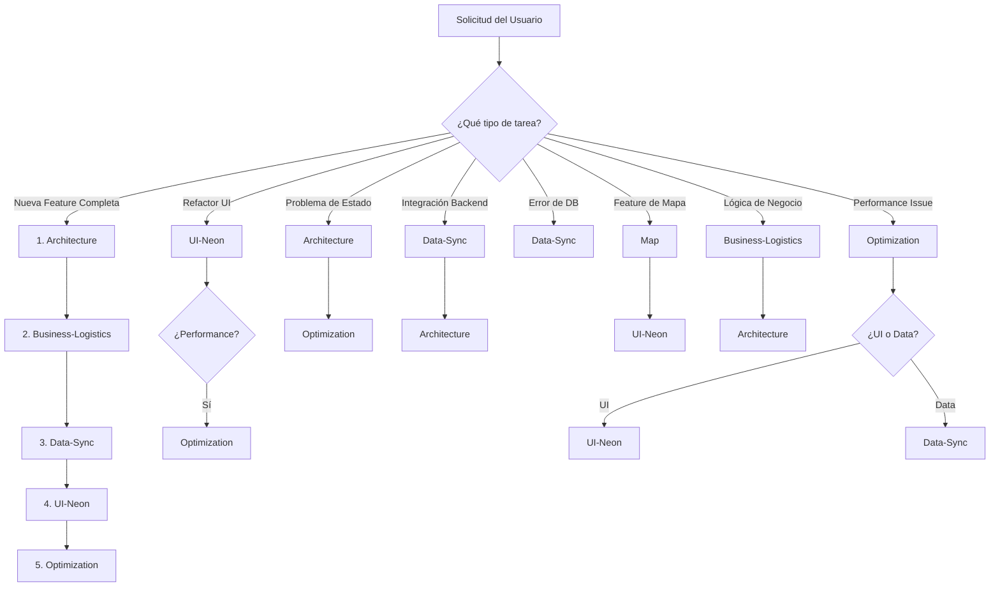

# Skills Orchestrator - Vector Delivery App

Este es el orquestador principal de skills para el proyecto Vector. Su función es analizar la tarea solicitada y determinar qué skill(s) especializada(s) debe usar el agente. Siempre escribira todo la documentación en español y el código en inglés.

## 🎯 Propósito

El orquestador actúa como un **"router inteligente"** que:
1. Analiza la solicitud del usuario
2. Identifica el dominio o área de trabajo
3. Selecciona la(s) skill(s) apropiada(s)
4. Combina múltiples skills cuando sea necesario

---

## 📋 Skills Disponibles

### 1. Architecture Skill
**Responsabilidad**: Estructura del proyecto y patrones arquitectónicos

**Cuándo usar**:
- ✅ Crear nuevas features con estructura Domain/Data/Presentation
- ✅ Configurar Dependency Injection (GetIt)
- ✅ Implementar state management (Riverpod/Bloc)
- ✅ Configurar navegación (GoRouter)
- ✅ Definir estrategia de testing (TDD)
- ✅ Resolver violaciones de dependencias entre capas
- ✅ Implementar manejo de errores (fpdart Either)

**Archivo**: [SKILL.md](skills/architecture/SKILL.md)

---

### 2. UI-Neon Skill
**Responsabilidad**: Sistema de diseño visual Neon-Dark Glassmorphism

**Cuándo usar**:
- ✅ Aplicar paleta de colores y tipografía
- ✅ Implementar efectos visuales (glassmorphism, neon glow)
- ✅ Crear animaciones y transiciones
- ✅ Implementar componentes de firma (NeonGlassCard, SafetySlideButton)
- ✅ Agregar feedback háptico
- ✅ Refactorizar UI para consistencia visual
- ✅ Optimizar widgets con RepaintBoundary (UI específico)

**Archivo**: [SKILL.md](skills/ui-neon/SKILL.md)

---

### 3. Optimization Skill
**Responsabilidad**: Performance técnico y optimización de bajo nivel

**Cuándo usar**:
- ✅ Implementar Isolates para operaciones pesadas
- ✅ Optimizar rebuilds de widgets
- ✅ Gestionar memoria eficientemente
- ✅ Garantizar 60 FPS constantes
- ✅ Optimizar animaciones con GPU acceleration
- ✅ Resolver problemas de performance
- ✅ Profiling y debugging de performance

**Archivo**: [SKILL.md](skills/optimization/SKILL.md)

---

### 4. Business-Logistics Skill
**Responsabilidad**: Lógica de negocio de la app de delivery

**Cuándo usar**:
- ✅ Definir reglas de negocio de rutas y paquetes
- ✅ Implementar flujos de trabajo del repartidor
- ✅ Definir estados y transiciones de paquetes
- ✅ Implementar validaciones de negocio
- ✅ Configurar scanner QR/Barcode (lógica)
- ✅ Definir confirmación de entregas (reglas)
- ✅ Implementar métricas de negocio (KPIs)

**Archivo**: [SKILL.md](skills/business-logistics/SKILL.md)

---

### 5. Map Skill
**Responsabilidad**: Integración de Mapbox y geolocalización

**Cuándo usar**:
- ✅ Configurar Mapbox SDK
- ✅ Implementar offline maps (tile caching)
- ✅ Implementar location tracking
- ✅ Crear polylines y rutas visuales
- ✅ Agregar markers y annotations
- ✅ Optimizar geocoding y búsqueda de direcciones
- ✅ Implementar lazy geocoding
- ✅ Resolver problemas de mapas

**Archivo**: [SKILL.md](skills/map/SKILL.md)

---

### 6. Data-Sync Skill
**Responsabilidad**: Sincronización de datos y persistencia local-first

**Cuándo usar**:
- ✅ Configurar PowerSync y Supabase
- ✅ Implementar CRUD operations local-first
- ✅ Resolver conflictos de sincronización
- ✅ Implementar idempotencia (upsert, retry)
- ✅ Configurar real-time subscriptions
- ✅ Implementar RLS policies
- ✅ Resolver errores de base de datos (PostgrestException)
- ✅ Optimizar queries y crear índices

**Archivo**: [SKILL.md](skills/data-sync/SKILL.md)

---

## 🔄 Flujo de Decisión



---

## 🎨 Patrones de Combinación de Skills

### Patrón 1: Nueva Feature Completa
**Ejemplo**: "Crear pantalla de gestión de paquetes"

**Skills en orden**:
1. **Architecture** → Definir estructura Domain/Data/Presentation
2. **Business-Logistics** → Definir reglas de negocio de paquetes
3. **Data-Sync** → Implementar CRUD local-first con PowerSync
4. **Architecture** → Implementar Providers/Bloc
5. **UI-Neon** → Crear screens y widgets con diseño Neon-Dark
6. **Optimization** → Optimizar lazy loading y rebuilds

---

### Patrón 2: Refactor de Screen Existente
**Ejemplo**: "Refactorizar AddPackageDialog para cumplir .ai-rules"

**Skills en orden**:
1. **Architecture** → Extraer lógica a ViewModel/Provider
2. **UI-Neon** → Dividir en widgets class-based con diseño consistente
3. **Optimization** → Optimizar rebuilds y performance

---

### Patrón 3: Implementar Feature de Mapa
**Ejemplo**: "Mostrar ruta del repartidor en el mapa"

**Skills en orden**:
1. **Business-Logistics** → Definir lógica de progreso de ruta
2. **Map** → Implementar polylines con gradiente
3. **UI-Neon** → Aplicar colores neon al gradiente
4. **Optimization** → Optimizar actualización de polylines

---

### Patrón 4: Fix de Bug de Sincronización
**Ejemplo**: "Paquetes duplicados en base de datos"

**Skills en orden**:
1. **Data-Sync** → Implementar upsert para idempotencia
2. **Architecture** → Verificar flujo correcto en Repository
3. **Optimization** → Implementar retry con exponential backoff

---

### Patrón 5: Implementar Scanner de Paquetes
**Ejemplo**: "Agregar scanner QR/Barcode para tracking numbers"

**Skills en orden**:
1. **Business-Logistics** → Definir lógica de validación y formatos
2. **Architecture** → Crear Use Case y Repository
3. **UI-Neon** → Crear UI del scanner con diseño Neon-Dark
4. **Optimization** → Procesar detección en Isolate si es necesario

---

### Patrón 6: Optimizar Performance de Lista
**Ejemplo**: "Lista de paquetes se traba al hacer scroll"

**Skills en orden**:
1. **Optimization** → Implementar lazy loading, RepaintBoundary
2. **Architecture** → Optimizar Provider con select()
3. **UI-Neon** → Asegurar uso de const widgets

---

## 📝 Instrucciones para el Agente

### Workflow Obligatorio

Cuando recibas una solicitud:

1. **Analiza** el contexto y la tarea
   - ¿Es nueva feature, refactor, bug fix, optimización?
   - ¿Qué capas del proyecto afecta?
   - ¿Requiere lógica de negocio?

2. **Identifica** qué skill(s) necesitas
   - Consulta la matriz de responsabilidades
   - Identifica si necesitas combinar skills
   - Determina el orden de aplicación

3. **Lee** el archivo SKILL.md correspondiente
   - **SIEMPRE** usa `view_file` para leer la skill completa
   - **NUNCA** asumas que conoces las instrucciones
   - Lee todas las skills necesarias antes de empezar

4. **Sigue** las instrucciones específicas de cada skill
   - Aplica las reglas de cada skill estrictamente
   - Verifica checklists de cada skill
   - Cumple con los estándares definidos

5. **Combina** múltiples skills si es necesario
   - Sigue los patrones de combinación
   - Mantén coherencia entre skills
   - No crees conflictos entre skills

6. **Verifica** que cumples con todas las reglas
   - Revisa `.ai-rules` globales
   - Verifica que no hay solapamientos
   - Asegura separación de concerns

---

## 🧭 Matriz de Decisión Rápida

| Tarea | Skills Principales | Skills Secundarias |
|-------|-------------------|-------------------|
| Nueva feature | Architecture, Business-Logistics | Data-Sync, UI-Neon, Optimization |
| Refactor UI | UI-Neon, Architecture | Optimization |
| Bug de DB | Data-Sync | Architecture |
| Performance | Optimization | Architecture, UI-Neon |
| Feature de mapa | Map, Business-Logistics | UI-Neon, Optimization |
| Lógica de negocio | Business-Logistics | Architecture |
| Sincronización | Data-Sync | Architecture, Optimization |
| Diseño visual | UI-Neon | - |
| Testing | Architecture | - |
| Navegación | Architecture | - |

---

## ⚠️ Reglas Críticas

> [!IMPORTANT]
> - **SIEMPRE** lee el SKILL.md completo antes de empezar
> - **NUNCA** asumas que conoces las instrucciones sin leerlas
> - **COMBINA** skills cuando la tarea lo requiera
> - **VERIFICA** que cumples con las reglas de cada skill
> - **RESPETA** la separación de responsabilidades entre skills

> [!WARNING]
> - NO mezcles responsabilidades entre skills
> - NO implementes lógica de negocio en skills técnicas
> - NO implementes detalles técnicos en business-logistics
> - NO dupliques información entre skills

---

## 🔍 Ejemplos Detallados de Uso

### Ejemplo 1: "Crear pantalla de paquetes"
**Análisis**: Nueva feature completa que requiere todas las capas

**Skills necesarias**:
1. **Architecture** (estructura)
   - Crear entities, repositories, use cases
   - Configurar Provider
   
2. **Business-Logistics** (reglas)
   - Definir estados de paquetes
   - Definir validaciones
   
3. **Data-Sync** (persistencia)
   - Implementar CRUD local-first
   - Configurar sync con Supabase
   
4. **UI-Neon** (diseño)
   - Crear PackagesScreen
   - Crear PackageCard con diseño Neon-Dark
   
5. **Optimization** (performance)
   - Implementar lazy loading
   - Optimizar rebuilds

---

### Ejemplo 2: "Fix error de duplicado en DB"
**Análisis**: Bug de sincronización

**Skills necesarias**:
1. **Data-Sync** (upsert, idempotencia)
   - Implementar upsert en lugar de insert
   - Agregar retry con exponential backoff
   
2. **Architecture** (verificar repository)
   - Verificar que Repository usa DataSource correctamente
   - Verificar manejo de errores con Either

---

### Ejemplo 3: "Optimizar performance del mapa"
**Análisis**: Problema de performance en feature específica

**Skills necesarias**:
1. **Optimization** (optimizar rebuilds)
   - Agregar RepaintBoundary al MapWidget
   - Implementar threshold para actualización de location
   
2. **Map** (optimización específica)
   - Optimizar actualización de markers
   - Implementar LERP smoothing para rotación
   
3. **Architecture** (state management)
   - Optimizar Provider con select()

---

### Ejemplo 4: "Implementar confirmación de entrega"
**Análisis**: Feature de negocio con UI y persistencia

**Skills necesarias**:
1. **Business-Logistics** (reglas)
   - Definir datos requeridos (foto, nombre, firma)
   - Definir validaciones
   
2. **Architecture** (estructura)
   - Crear DeliveryConfirmation entity
   - Crear ConfirmDelivery use case
   
3. **Data-Sync** (persistencia)
   - Guardar confirmación localmente
   - Sync con Supabase
   
4. **UI-Neon** (diseño)
   - Crear DeliveryConfirmationScreen
   - Implementar SafetySlideButton (hold to confirm)
   
5. **Optimization** (performance)
   - Optimizar carga de imagen
   - Evitar lag de teclado

---

## 📊 Separación de Responsabilidades

| Concepto | Skill Correcta | ❌ Skill Incorrecta |
|----------|---------------|-------------------|
| Clean Architecture | Architecture | Business-Logistics |
| Riverpod/Bloc | Architecture | Optimization |
| Colores Neon | UI-Neon | Business-Logistics |
| Glassmorphism | UI-Neon | Architecture |
| Isolates | Optimization | Architecture |
| 60 FPS | Optimization | UI-Neon |
| Estados de Paquetes | Business-Logistics | Data-Sync |
| Validaciones de Negocio | Business-Logistics | Architecture |
| Mapbox Setup | Map | Optimization |
| Offline Maps | Map | Data-Sync |
| PowerSync | Data-Sync | Architecture |
| Idempotency | Data-Sync | Business-Logistics |

---

## 🚀 Workflow Completo de Ejemplo

**Solicitud**: "Crear feature de gestión de rutas diarias"

### Paso 1: Análisis
- **Tipo**: Nueva feature completa
- **Capas afectadas**: Domain, Data, Presentation
- **Requiere**: Lógica de negocio, persistencia, UI

### Paso 2: Identificar Skills
- Architecture (estructura)
- Business-Logistics (reglas de rutas)
- Data-Sync (persistencia)
- UI-Neon (diseño)
- Optimization (performance)

### Paso 3: Leer Skills
```
view_file(architecture/SKILL.md)
view_file(business-logistics/SKILL.md)
view_file(data-sync/SKILL.md)
view_file(ui-neon/SKILL.md)
view_file(optimization/SKILL.md)
```

### Paso 4: Implementar en Orden
1. **Architecture**: Crear estructura Domain/Data/Presentation
2. **Business-Logistics**: Definir estados y reglas de rutas
3. **Data-Sync**: Implementar CRUD local-first
4. **Architecture**: Crear RouteProvider
5. **UI-Neon**: Crear RoutesScreen con diseño Neon-Dark
6. **Optimization**: Optimizar lista de rutas

### Paso 5: Verificar
- ✅ Cumple con Clean Architecture
- ✅ Reglas de negocio correctas
- ✅ Sync offline funcional
- ✅ Diseño consistente con Neon-Dark
- ✅ Performance óptimo (60 FPS)

---

**Última actualización**: 2026-01-15